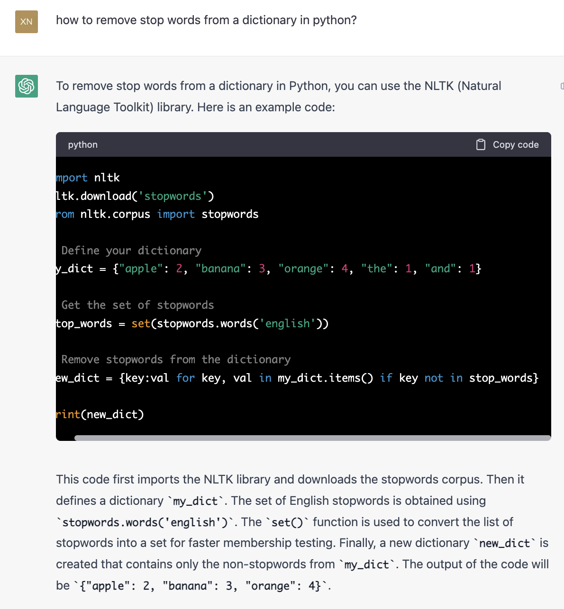
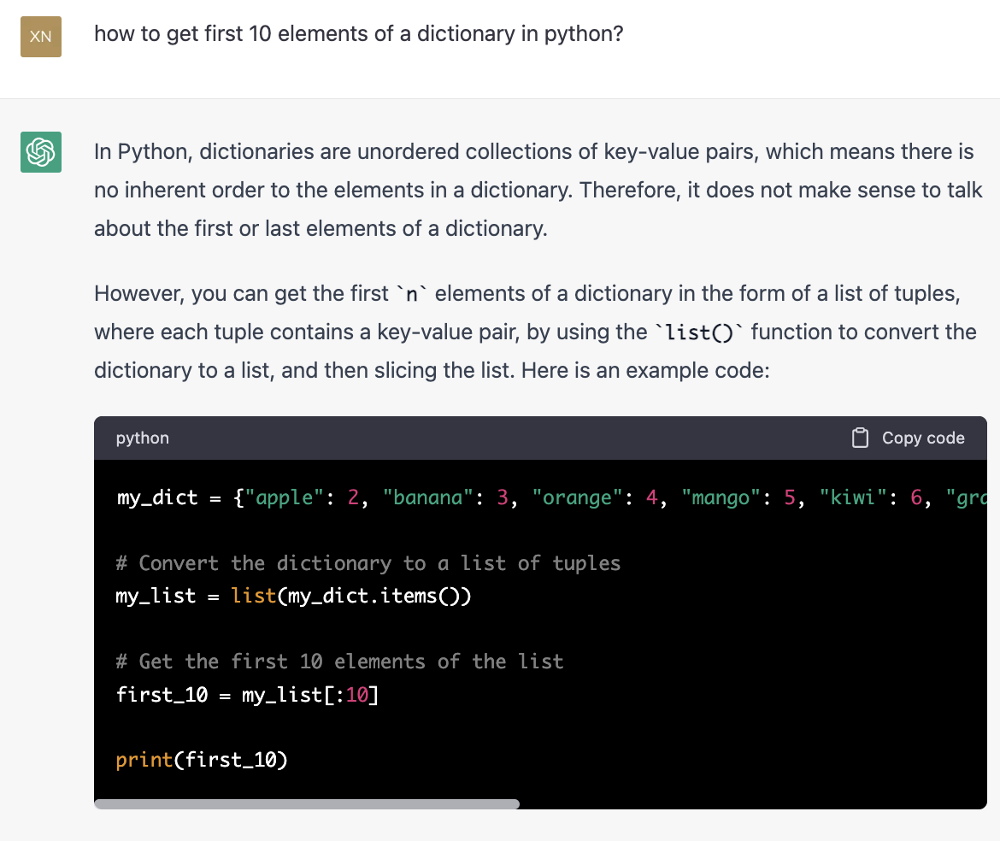
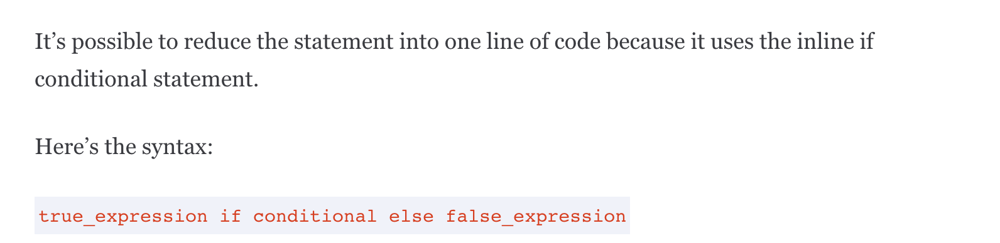
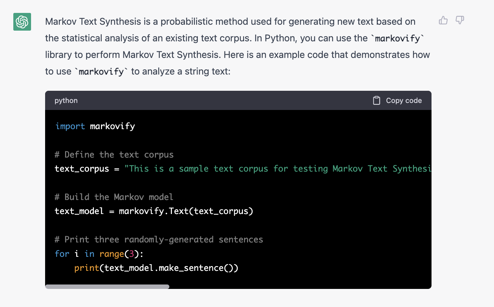
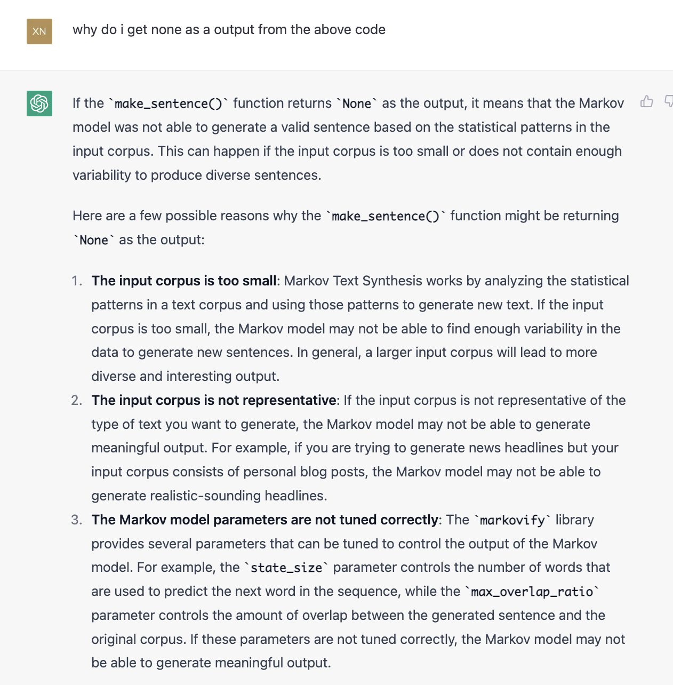
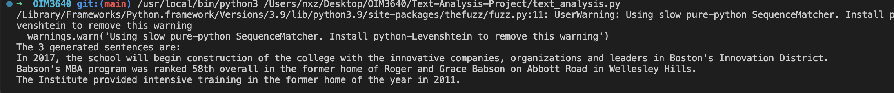

# Text-Analysis-Project
 
**1. Project Overview** (~1 paragraph)

I used the wikipedia data source. The techniques i used to analyze the text would be obtaining the word frequencies in a dictionary, followed by computing summary statistics - i removed stop words and non-alphabetical characters that could be mistaken for a word, and then returned a dictionary with the top 10 most common words found from the website, in this case I used the results given when searching for 'Babson College' on wikipedia. Apart from these methods, I also used NLP to perform sediment analysis. I hope to learn how to better analyze text using python effectively and to be more familiar with the importing methods and how to install packages on the computer in the best manner. I also used Markov Text Synthesis to generate 3 random sentences based on the wikipedia text.  

**2. Implementation** (~1-2 paragraphs + screenshots)

My code breaks the functionalities down to each function, where each function carries out a specific process. There is a main function at the bottom of the page called main(), which will only run if the condition __name__ == "__main__" is met. This main function will format and call the other functions which will carry out the different text analysis methods. 

For my code dilemma, I was stuck between trying to sort the dictionary first based on the values in a step by step process, or using this one liner method (inline conditional statement) which i was not entirely sure about. After consulting chatGPT, i understood the use of inline conditional statements and the amount of space it could save - though it might not necessarily mean better coding practices. I further did research on how inline conditional statement works. 

For Markov Text Synthesis, I made use of the Markov built in functions and ChatGPT to explain to me how it works and how I can implement it.
 

I also encountered the problem where my synthesized output kept returning me none. I then consulted chatGPT to find out the reasons why markov text synthesis could be returning none. 

**3. Results** (~2-3 paragraphs + figures/examples)

In this project, I managed to obtain the top 10 most used terms in the text in a sorted manner. I also carried sediment analysis and found that the wikipedia text with search for 'Babson College' returned a mood of 'Neutral' with a score of 1.0. and every other mood was rated a 0.0. Moreover, I also analyzed the text similarity between the search results for 'Babson College' and other searches, for instance, 'Harvard University'. This similarity analysis returned a result of 2. 

    school_page = wikipedia.page("Harvard University")
    similarity = text_similarity(babson.content, school_page.content)

For the Markov Text synthesis, i managed to generate 3 different sentences based on the wikipedia page that i was analyzing. 

**4. Reflection** (~1-2 paragraphs)

The returning of the code went smoothly, as what was returned was what i had expected to see. I also managed to learn how to better organize my code, as well as how to correctly import the different libraries into my computer using PIP, and also troubleshooting by googling for help, which has made me a more independent learner. ChatGPT was able to explain to me how certain analysis method works, for example I consulted chatGPT on how Markov Text Synthesis works in python, which enabled me to better understand what this method does. I will use what I learnt going forward in the future when i need more python libraries to be installed, i now better understand how to install it right. Stack Overflow was a good source of help as well. 

What i wished i knew before hand was that there are different python interpreters on one's computer, and using VSCode allows users to pick a interpreter to run the code, which i did not know, and i was running the code using a different interpreter and could not access my downloaded libraries. Having this knowledge ahead would have saved me time and trouble shooting. I think my project was appropriately scoped, with a good amount of analysis and time management for each function i created. 
